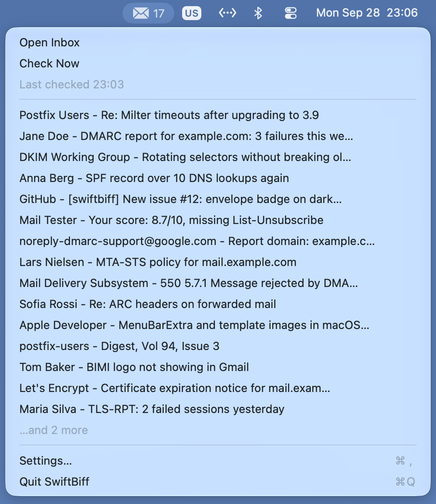
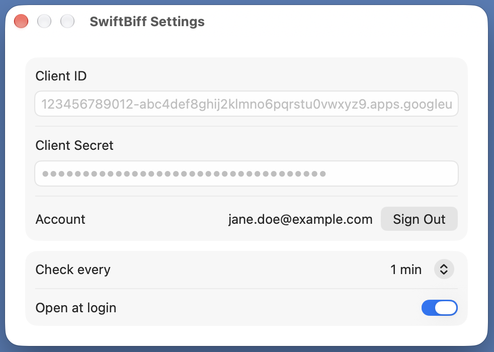

# SwiftBiff

SwiftBiff is a macOS menu bar app for Gmail. It shows how many unread conversations are in your inbox, lists the sender and subject of the newest ones, and opens the inbox or a clicked conversation in your default browser.



SwiftBiff asks Google for the `gmail.metadata` scope and nothing else. That scope covers labels, counts and message headers. It does not cover message bodies or attachments, so SwiftBiff cannot read your mail even if it wanted to. It cannot send, delete or change anything either.

SwiftBiff keeps your client ID, client secret and refresh token in the login keychain under `dk.thrysoee.swiftbiff`. The access token only lives in memory. Your email address and the check interval are stored in the app's preferences. SwiftBiff talks to Google and to nobody else.

Requires macOS 27.

## Google Cloud setup

SwiftBiff has no shared Google client. You create your own, once. It takes about ten minutes.

1. Create a project in the [Google Cloud console](https://console.cloud.google.com/).
2. Enable the Gmail API. Go to APIs & Services, then Library, search for "Gmail API" and click Enable.
3. Configure the OAuth consent screen under Google Auth Platform.
   - With a Google Workspace account, pick Internal as the audience.
   - With a gmail.com account, pick External. Then publish the app so its status is "In production". In "Testing", Google expires refresh tokens after 7 days and you would have to sign in again every week. You will get a one-time "Google hasn't verified this app" warning when you sign in. That is expected for a personal client, so click Advanced and continue.
4. Under Data Access, add the scope `https://www.googleapis.com/auth/gmail.metadata`.
5. Under Clients, create an OAuth client with application type "Desktop app". Copy the client ID and client secret.
6. Open SwiftBiff's Settings, paste the client ID and secret, and click Sign In. Your browser opens Google's consent screen. After you approve, the tab says you can close it.

   

A Workspace admin can block restricted Gmail scopes like `gmail.metadata` for apps they have not configured. If sign-in fails with an admin policy error, ask your admin to allow your client ID.

## Build

You need Xcode 27 and an Apple ID signed in to Xcode. The free Personal Team is enough.

1. Create `Config/Local.xcconfig` with your team ID. You can find it in Xcode under Settings, Accounts.

   ```
   DEVELOPMENT_TEAM = ABCDE12345
   ```

2. Build and test.

   ```sh
   xcodebuild -project swiftbiff.xcodeproj -scheme swiftbiff -destination 'platform=macOS' -allowProvisioningUpdates test
   xcodebuild -project swiftbiff.xcodeproj -scheme swiftbiff -configuration Release -derivedDataPath build -allowProvisioningUpdates build
   ```

   The first build with `-allowProvisioningUpdates` creates an Apple Development certificate for your team.

3. Copy the app to `/Applications`.

   ```sh
   cp -R build/Build/Products/Release/SwiftBiff.app /Applications/
   ```

## License

MIT. See [LICENSE](LICENSE).
